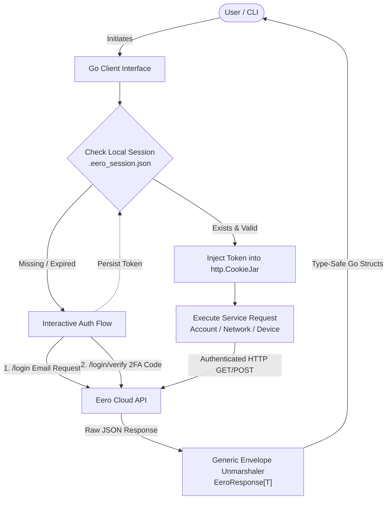

# eero-go

[](https://pkg.go.dev/github.com/arvarik/eero-go)
[](https://github.com/arvarik/eero-go/actions/workflows/ci.yml)
[](https://opensource.org/licenses/MIT)

`eero-go` is an unofficial, highly robust Go client library for interacting with the Eero Mesh Router API. 

Designed for performance and security, it seamlessly handles eero's two-step authentication, manages API cookie sessions thread-safely, and surfaces strongly-typed structs for your local network topology.

**Disclaimer:** This is an unofficial open-source library and is not affiliated with, endorsed by, or supported by Eero or Amazon.

## Features

- **No External Dependencies**: Built entirely upon the Go standard library (`net/http`, `context`, `encoding/json`).
- **Secure By Default**: Hardened `http.Transport` against connection exhaustion, 5MB `io.LimitReader` caps against OOM attacks, and strictly managed `cookiejar` states protecting session leaks.
- **Idiomatic Typings**: Extracts eero's deeply nested JSON envelopes into clean, traversable Go structs using Go 1.18+ Generics, dropping missing data fields safely to pointer `nil` values.

## Component Architecture

The library is modularized by functional domains to provide strict operational boundaries:

- `client.go`: Centralizes the HTTP `Client`, enforces security boundaries, limits payload sizes, and manages the thread-safe `net/http/cookiejar`.
- `auth.go`: Manages the undocumented 2-step verification challenge (Email/Phone -> OTP).
- `account.go`: Retrieves top-level user account details and base networking routing URLs.
- `network.go`: Safely parses Eero's `{"meta": {}, "data": {}}` JSON payloads to expose network operational status, exact port speeds, and health metrics.
- `device.go`: Lists all connected and recently offline devices, safely mapping absent optional fields (like IPs for offline devices) to `nil` using `*string` pointers.
- `profile.go`: Manages groupings of devices and offers the ability to pause/unpause internet blocks.

## System Workflow Diagram



## Session Management

Authentication with Eero relies on a persistent session cookie (`s=user_token`). The `eero-go` client abstracts this away entirely:

1. Upon successful login, the token is transparently injected into the underlying `http.CookieJar`.
2. For long-running or local CLI tools, you can extract this `user_token` and save it locally (e.g., to a restrictive `0600` permission `.eero_session.json` file).
3. On subsequent boots, use `client.SetSessionCookie(token)` to instantly restore authorization without pinging users for another 2FA code.

## Installation

You need Go `1.21` or higher installed.

```bash
go get github.com/arvarik/eero-go
```

## Quick Start

The repository includes a fully-functional interactive CLI example at [`cmd/example/main.go`](cmd/example/main.go). This script demonstrates how to authenticate, cache your session securely, and fetch live network speeds and connected devices.

### Step 1: Run the Example CLI
Execute the example directly from the command line:
```bash
go run ./cmd/example
```

### Step 2: Interactive Authentication
If this is your first time connecting, the script will prompt you for your Eero account email or phone number. A verification code will be sent to your device.

```bash
Enter your eero email: myemail@example.com
Check your email for the code: 123456
Authenticated!
```

### Step 3: Understanding the Session Cache (`.eero_session.json`)
Upon successful login, `eero-go` extracts your authenticated `user_token` and saves it to a hidden file in your current directory named `.eero_session.json`. 

**Why is this needed?**
Eero's API enforces strict rate limits on authentication requests. By caching the token locally (with strict `0600` file permissions), the client can instantly bypass the 2-step verification challenge on subsequent runs. This is critical for automated cron jobs or home lab monitoring scripts that need to poll the API repeatedly without spamming your phone with verification texts.

To reset your session, simply delete the `.eero_session.json` file.

### Step 4: Using cURL with the Cached Session
Once you have the `.eero_session.json` file, you can easily use the extracted `user_token` to make direct API calls from your command line using `curl`. 

Here are examples for all the available read-only (`GET`) endpoints:

```bash
# Extract the token and save it to a variable (requires jq)
TOKEN=$(jq -r '.user_token' .eero_session.json)

# 1. Fetch your account details and networks
curl -s -H "Cookie: s=$TOKEN" "https://api-user.e2ro.com/2.2/account" | jq

# 2. Fetch specific network details (replace {network_id} with your network's ID from Step 1)
curl -s -H "Cookie: s=$TOKEN" "https://api-user.e2ro.com/2.2/networks/{network_id}" | jq

# 3. Fetch all connected and offline devices for a network
curl -s -H "Cookie: s=$TOKEN" "https://api-user.e2ro.com/2.2/networks/{network_id}/devices" | jq

# 4. Fetch all device profiles (e.g., family member groupings) for a network
curl -s -H "Cookie: s=$TOKEN" "https://api-user.e2ro.com/2.2/networks/{network_id}/profiles" | jq
```

## Example API Calls

The library provides individual services attached to the core `Client`. Below are comprehensive examples of what you can extract and enact using each service.

### 1. Account Service
Retrieve the overarching account details, your registered email/phone, and extract the internal URLs mapping to your meshes.
```go
acct, err := client.Account.Get(ctx)
fmt.Println("Account Name:", acct.Name)           // "Home Mesh"
fmt.Println("Network URL:", acct.Networks.Data[0].URL) // "/2.2/networks/12345"
```

### 2. Network Service
Pull granular details about a specific network, including speeds, online status, guest networking, and physically connected Eero hardware Nodes. You can also trigger a full network reboot.
```go
// Fetch network status and speeds
net, err := client.Network.Get(ctx, networkURL)
fmt.Println("Status:", net.Status)                                      // "online"
fmt.Printf("Speed: %.1f %s Down\n", net.Speed.Down.Value, net.Speed.Down.Units) // 850.5 Mbps

// Iterate over the physical Eero router boxes
for _, eeroNode := range net.Eeros {
	fmt.Printf("Model: %s, Firmware: %s, Gateway: %t\n", 
		eeroNode.Model, eeroNode.Firmware, eeroNode.Gateway)
}

// Reboot the entire network
err = client.Network.Reboot(ctx, networkURL)
```

### 3. Device Service
Scan the network for all known client devices (phones, laptops, IoT gadgets). This handles both currently connected devices and offline devices, safely parsing absent JSON fields.
```go
devices, err := client.Device.List(ctx, networkURL)

for _, d := range devices {
	// Safely dereference optional Nickname pointer
	name := "Unknown Device"
	if d.Nickname != nil {
		name = *d.Nickname
	}
	
	fmt.Printf("Device: %s\n", name)
	fmt.Printf("Connected: %t (Type: %s)\n", d.Connected, d.DeviceType)
	fmt.Printf("Last Active: %s\n", d.LastActive.Format(time.RFC3339))
}
```

### 4. Profile Service
Profiles group devices together (e.g., "Kids Devices"). You can fetch these profiles and pause or unpause internet access to grouped devices globally.
```go
profiles, err := client.Profile.List(ctx, networkURL)

for _, p := range profiles {
	fmt.Printf("Profile: %s (Paused: %t)\n", p.Name, p.Paused)
	
	// Example: Pause internet for this specific profile
	// client.Profile.Pause(ctx, p.URL)
}
```

### 5. Custom Session Injection
If you manage your session tokens externally (e.g., in a secure vault like Hashicorp Vault or a Kubernetes Secret), you can inject the token directly into the client's thread-safe cookie jar, bypassing the `Auth` service completely.
```go
client.SetSessionCookie("your-secret-user-token")
```

## Testing

The test suite validates memory safety limits and concurrency using standard library `httptest` mock servers and parallel table execution. No third-party mocking libraries are strictly required!

```bash
# Run the test suite with the race detector
make test
```

## Building for Home Labs

The included `Makefile` handles cross-compilation for headless servers and minimal Linux environments (like Proxmox or TrueNAS).

```bash
# Compile for standard 64-bit Linux machines
make build-linux-amd64

# Compile for ARM servers (e.g., Raspberry Pi 4/5)
make build-linux-arm64

# Clean up build artifacts
make clean
```

## License

This project is licensed under the MIT License - see the `LICENSE` file for details.
